# Looking at the Super Bowl

### Cliff Green

## Introduction

NYC Taxi and Limousine Commission (TLC) collects all trip data for Yellow, Green, and For-Hire-Vehicles (FHV). Trip data is published monthly and available on this website: http://www.nyc.gov/html/tlc/html/about/trip_record_data.shtml Since February is nearing, we would like to spend some time analyzing February of 2016 Yellow Cab trip data. In particular with Superbowl 2017 approaching, we would like to analyze trip data for Superbowl Sunday in 2016. Although, Superbowl 2016 was not in New York, we would like to see if there is an impact of a large sporting event watched by many on the taxi industry in NYC. Our analysis will focus on Super Bowl Sunday and contrast this data with the three other Sundays (February 14, February 21, and February 28) in an attemtp to detect any interesting charcteristics in regards to Yellow Cab trip's on the Superbowl Sunday of 2016.

### Datset Description

February 2016 Yellow Cab Data set is available for download on this website http://www.nyc.gov/html/tlc/html/about/trip_record_data.shtml. This dataset has over 11 million records and each record has 19 columns. The data dictionary for the dataset is available here: http://www.nyc.gov/html/tlc/downloads/pdf/data_dictionary_trip_records_yellow.pdf The dataset offers some intersting information in ragards to the passenger counts, trip distance, pick and dropoff locations, fare amounts, pick up and drop off times.
The basic information in regards to the dataset is available below.


```
import sys
import pandas as pd
import matplotlib
import matplotlib.pyplot as plt
import numpy as np
import scipy.stats as stats
import seaborn as sns
#import warnings
#warnings.filterwarnings('ignore')
%matplotlib inline
```


```
from mpl_toolkits.basemap import Basemap
```


```
import pandas as pd
df = pd.read_csv("yellow_tripdata_2016-02.csv")
df.describe()
```


<div>
<table border="1" class="dataframe">
  <thead>
    <tr style="text-align: right;">
      <th></th>
      <th>VendorID</th>
      <th>passenger_count</th>
      <th>trip_distance</th>
      <th>pickup_longitude</th>
      <th>pickup_latitude</th>
      <th>RatecodeID</th>
      <th>dropoff_longitude</th>
      <th>dropoff_latitude</th>
      <th>payment_type</th>
      <th>fare_amount</th>
      <th>extra</th>
      <th>mta_tax</th>
      <th>tip_amount</th>
      <th>tolls_amount</th>
      <th>improvement_surcharge</th>
      <th>total_amount</th>
    </tr>
  </thead>
  <tbody>
    <tr>
      <th>count</th>
      <td>1.138205e+07</td>
      <td>1.138205e+07</td>
      <td>1.138205e+07</td>
      <td>1.138205e+07</td>
      <td>1.138205e+07</td>
      <td>1.138205e+07</td>
      <td>1.138205e+07</td>
      <td>1.138205e+07</td>
      <td>1.138205e+07</td>
      <td>1.138205e+07</td>
      <td>1.138205e+07</td>
      <td>1.138205e+07</td>
      <td>1.138205e+07</td>
      <td>1.138205e+07</td>
      <td>1.138205e+07</td>
      <td>1.138205e+07</td>
    </tr>
    <tr>
      <th>mean</th>
      <td>1.532299e+00</td>
      <td>1.655208e+00</td>
      <td>5.060763e+00</td>
      <td>-7.282504e+01</td>
      <td>4.011798e+01</td>
      <td>1.037623e+00</td>
      <td>-7.288799e+01</td>
      <td>4.015357e+01</td>
      <td>1.331287e+00</td>
      <td>1.241413e+01</td>
      <td>3.302671e-01</td>
      <td>4.977197e-01</td>
      <td>1.772410e+00</td>
      <td>2.884042e-01</td>
      <td>2.997138e-01</td>
      <td>1.560264e+01</td>
    </tr>
    <tr>
      <th>std</th>
      <td>4.989557e-01</td>
      <td>1.311945e+00</td>
      <td>4.122976e+03</td>
      <td>9.149828e+00</td>
      <td>5.040509e+00</td>
      <td>5.647826e-01</td>
      <td>8.898119e+00</td>
      <td>4.903239e+00</td>
      <td>4.859976e-01</td>
      <td>7.095194e+01</td>
      <td>5.681833e-01</td>
      <td>5.182089e-02</td>
      <td>2.505291e+00</td>
      <td>1.655873e+00</td>
      <td>1.239174e-02</td>
      <td>7.140526e+01</td>
    </tr>
    <tr>
      <th>min</th>
      <td>1.000000e+00</td>
      <td>0.000000e+00</td>
      <td>-3.390584e+06</td>
      <td>-1.308291e+02</td>
      <td>-7.703949e+01</td>
      <td>1.000000e+00</td>
      <td>-1.226153e+02</td>
      <td>-7.703949e+01</td>
      <td>1.000000e+00</td>
      <td>-4.500000e+02</td>
      <td>-4.760000e+01</td>
      <td>-1.000000e+00</td>
      <td>-3.500000e+01</td>
      <td>-9.999000e+01</td>
      <td>-3.000000e-01</td>
      <td>-4.503000e+02</td>
    </tr>
    <tr>
      <th>25%</th>
      <td>1.000000e+00</td>
      <td>1.000000e+00</td>
      <td>1.000000e+00</td>
      <td>-7.399171e+01</td>
      <td>4.073639e+01</td>
      <td>1.000000e+00</td>
      <td>-7.399126e+01</td>
      <td>4.073463e+01</td>
      <td>1.000000e+00</td>
      <td>6.500000e+00</td>
      <td>0.000000e+00</td>
      <td>5.000000e-01</td>
      <td>0.000000e+00</td>
      <td>0.000000e+00</td>
      <td>3.000000e-01</td>
      <td>8.300000e+00</td>
    </tr>
    <tr>
      <th>50%</th>
      <td>2.000000e+00</td>
      <td>1.000000e+00</td>
      <td>1.660000e+00</td>
      <td>-7.398160e+01</td>
      <td>4.075338e+01</td>
      <td>1.000000e+00</td>
      <td>-7.397968e+01</td>
      <td>4.075377e+01</td>
      <td>1.000000e+00</td>
      <td>9.000000e+00</td>
      <td>0.000000e+00</td>
      <td>5.000000e-01</td>
      <td>1.350000e+00</td>
      <td>0.000000e+00</td>
      <td>3.000000e-01</td>
      <td>1.175000e+01</td>
    </tr>
    <tr>
      <th>75%</th>
      <td>2.000000e+00</td>
      <td>2.000000e+00</td>
      <td>3.050000e+00</td>
      <td>-7.396679e+01</td>
      <td>4.076789e+01</td>
      <td>1.000000e+00</td>
      <td>-7.396230e+01</td>
      <td>4.076934e+01</td>
      <td>2.000000e+00</td>
      <td>1.400000e+01</td>
      <td>5.000000e-01</td>
      <td>5.000000e-01</td>
      <td>2.350000e+00</td>
      <td>0.000000e+00</td>
      <td>3.000000e-01</td>
      <td>1.716000e+01</td>
    </tr>
    <tr>
      <th>max</th>
      <td>2.000000e+00</td>
      <td>9.000000e+00</td>
      <td>1.165853e+07</td>
      <td>9.464387e+01</td>
      <td>5.934835e+01</td>
      <td>9.900000e+01</td>
      <td>3.889659e+01</td>
      <td>4.053167e+02</td>
      <td>4.000000e+00</td>
      <td>1.548104e+05</td>
      <td>6.379700e+02</td>
      <td>8.050000e+01</td>
      <td>6.221100e+02</td>
      <td>9.130000e+02</td>
      <td>3.000000e-01</td>
      <td>1.548321e+05</td>
    </tr>
  </tbody>
</table>
</div>


## Data Cleaning

First I started of cleaning some pretty straightforward variables. Passenger count should be greater than zero, fare amount needs to be greater than or equal to 2.50, because that is the base charger for riding a taxi. Extra, Tip amount, and tolls amount must all be greater than 0. We saw a couple observations that were showing negative values for these variables. Total amount must be greater than 2.50 for the same reason as fare amount. Trip distance must be greater than 0 because they trips must have gone somewhere.


```
df.drop(['improvement_surcharge','mta_tax','store_and_fwd_flag'], axis = 1, inplace = True, errors = 'ignore')
```


```
df = df.loc[df['passenger_count'] > 0]# zero values dont make sense
df = df.loc[df['fare_amount'] >= 2.5]# according to the website the base amount is 2.5
df = df.loc[df['extra'] >= 0]# negative values dont make sense
df = df.loc[df['tip_amount'] >= 0]#^
df = df.loc[df['total_amount'] >= 2.5]
df = df.loc[df['tolls_amount'] >= 0]#negative values dont make senes
df = df.loc[df['trip_distance'] > 0]#
df = df.loc[(df['RatecodeID'] <= 6) & (df['RatecodeID'] >= 1)]
#add max price and max distance
```


```
df = df.loc[df['dropoff_latitude'] >= 35]
df = df.loc[df['pickup_latitude'] >= 35]
df = df.loc[df['dropoff_longitude'] < 0]
df = df.loc[df['pickup_longitude'] < 0]
```


```
df.shape[0] - df.dropna().shape[0]#looks for NA
```


    0


## Subsetting the data

So for the data visualization portion of this project we are going to focus on two specific days of 2016. The first day we choose was February 7, 2016 which was the day the Super Bowl took place and the second day is going to serve as a control day so the increase or decrease of traffic can be compared to a baseline. The day that was selected for this was February 21, 2016. Initially we chose the 14th but we quickly realized that valentine’s day. So two subsets of the data were created. Sunday7 and Sunday21, for each Sunday chosen.


```
#replace all pickup and dropoff times to datetime instead of object types
df['tpep_pickup_datetime'] = pd.to_datetime(df['tpep_pickup_datetime'], format = '%Y-%m-%d %H:%M:%S')
df['tpep_dropoff_datetime'] = pd.to_datetime(df['tpep_dropoff_datetime'], format = '%Y-%m-%d %H:%M:%S')
```

- Creates a subset for the 7th


```
#select all trips that have originated on super bowl sunday
super_bowl_sunday_trips =  df[(df['tpep_pickup_datetime'] > '2/7/2016') & (df['tpep_pickup_datetime'] <= '2/8/2016')]
Sunday7 = super_bowl_sunday_trips
#Sunday7.count()
```

- Creates a subset for the 21st


```
Sunday21 =  df[(df['tpep_pickup_datetime'] > '2/21/2016') & (df['tpep_pickup_datetime'] <= '2/22/2016')]
#Sunday21.count()
```

- Creates a subset for the 28st


```
Sunday28 =  df[(df['tpep_pickup_datetime'] > '2/28/2016') & (df['tpep_pickup_datetime'] <= '2/29/2016')]
#Sunday28.count()

```

## Data Observation 
So here we created three different subsets of the data, the first is a subset of the super bowl, the second is a subset of valentine’s day, and the third is a random Sunday (the 21st).  First we looked at the number of trips per day. There were 364,839 rides for the control Sunday, and 365,009 rides for super bowl Sunday.


```
Sunday7[['tolls_amount','total_amount', 'trip_distance','fare_amount','tip_amount']].hist(bins = 30)
```


    array([[<matplotlib.axes._subplots.AxesSubplot object at 0x16d793400>,
            <matplotlib.axes._subplots.AxesSubplot object at 0x16dcf9eb8>],
           [<matplotlib.axes._subplots.AxesSubplot object at 0x16d746ba8>,
            <matplotlib.axes._subplots.AxesSubplot object at 0x16e098cf8>],
           [<matplotlib.axes._subplots.AxesSubplot object at 0x16e2de048>,
            <matplotlib.axes._subplots.AxesSubplot object at 0x16e50c7f0>]], dtype=object)


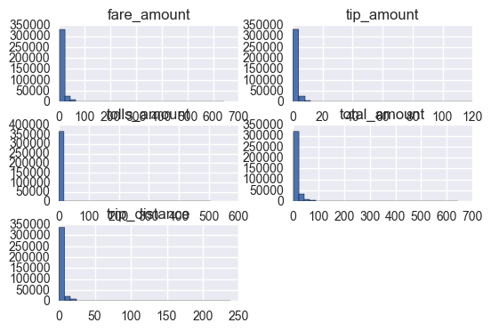


```
Sunday21[['tolls_amount','total_amount', 'trip_distance','fare_amount','tip_amount']].hist(bins = 30)
```


    array([[<matplotlib.axes._subplots.AxesSubplot object at 0x16e6345f8>,
            <matplotlib.axes._subplots.AxesSubplot object at 0x16f724dd8>],
           [<matplotlib.axes._subplots.AxesSubplot object at 0x16f8cb668>,
            <matplotlib.axes._subplots.AxesSubplot object at 0x16faa4160>],
           [<matplotlib.axes._subplots.AxesSubplot object at 0x16fd39a90>,
            <matplotlib.axes._subplots.AxesSubplot object at 0x16fe62be0>]], dtype=object)


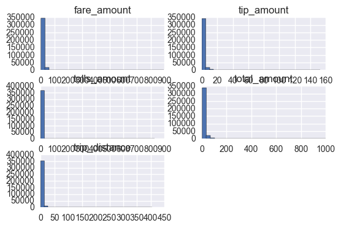


```
Sunday28[['tolls_amount','total_amount', 'trip_distance','fare_amount','tip_amount']].hist(bins = 30)
```


    array([[<matplotlib.axes._subplots.AxesSubplot object at 0x000002515BC16F98>,
            <matplotlib.axes._subplots.AxesSubplot object at 0x000002515CEDF0B8>],
           [<matplotlib.axes._subplots.AxesSubplot object at 0x000002515B550908>,
            <matplotlib.axes._subplots.AxesSubplot object at 0x0000025185E802B0>],
           [<matplotlib.axes._subplots.AxesSubplot object at 0x0000025147B6A3C8>,
            <matplotlib.axes._subplots.AxesSubplot object at 0x0000025147B781D0>]], dtype=object)


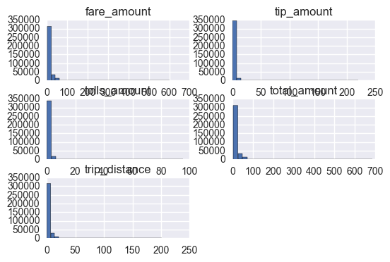


## Removing outliers
Given the size of the data we are working with, we decided to remove a lot of the extreme outliers seen by only including data points that were 3 standards deviations away from the mean. This effectively removes the extremely outliers that tend to cause problems during analysis. To give an example of what I am talking about, the max ‘total fare’ is 154832, which makes zero sense. The only explanation can be that this person was driven to the moon and back. Funny enough the max trip distance is 1,1658,534 which is more than enough distance to travel to the moon and back. To rectify this we trimmed the data  at 3 standard deviations for the variables: fare amount, total amount, tolls amount, and trip distance. Looking at this histograms below, the distributions look much better than above.


```
List = ['fare_amount', 'total_amount', 'tolls_amount', 'trip_distance']
for i in List:
    Sunday21 = Sunday21[((Sunday21[i] - Sunday21[i].mean()) / Sunday21[i].std()).abs() < 3]# this line was found on stackof
    Sunday7 = Sunday7[((Sunday7[i] - Sunday7[i].mean()) / Sunday7[i].std()).abs() < 3]
    Sunday28 = Sunday28[((Sunday28[i] - Sunday28[i].mean()) / Sunday28[i].std()).abs() < 3]


```


```
Sunday7[['tolls_amount','total_amount', 'trip_distance','fare_amount','tip_amount']].hist(bins = 30)
```


    array([[<matplotlib.axes._subplots.AxesSubplot object at 0x1702177f0>,
            <matplotlib.axes._subplots.AxesSubplot object at 0x1714bab00>],
           [<matplotlib.axes._subplots.AxesSubplot object at 0x1715f7b00>,
            <matplotlib.axes._subplots.AxesSubplot object at 0x171757dd8>],
           [<matplotlib.axes._subplots.AxesSubplot object at 0x1719e4198>,
            <matplotlib.axes._subplots.AxesSubplot object at 0x171c08160>]], dtype=object)


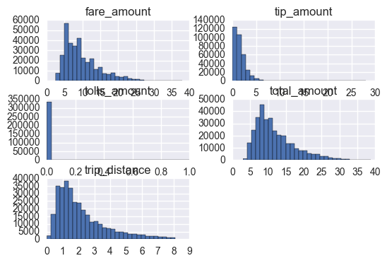


```
Sunday21[['tolls_amount','total_amount', 'trip_distance','fare_amount','tip_amount']].hist(bins = 30)
```


    array([[<matplotlib.axes._subplots.AxesSubplot object at 0x171e88d30>,
            <matplotlib.axes._subplots.AxesSubplot object at 0x173dfb240>],
           [<matplotlib.axes._subplots.AxesSubplot object at 0x1741e9cc0>,
            <matplotlib.axes._subplots.AxesSubplot object at 0x1742e15c0>],
           [<matplotlib.axes._subplots.AxesSubplot object at 0x1748740f0>,
            <matplotlib.axes._subplots.AxesSubplot object at 0x1749bfef0>]], dtype=object)


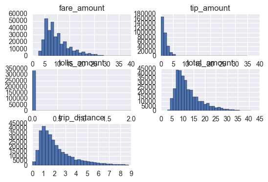


```
Sunday28[['tolls_amount','total_amount', 'trip_distance','fare_amount','tip_amount']].hist(bins = 30)
```


    array([[<matplotlib.axes._subplots.AxesSubplot object at 0x00000251D32E9B70>,
            <matplotlib.axes._subplots.AxesSubplot object at 0x00000251D86BF978>],
           [<matplotlib.axes._subplots.AxesSubplot object at 0x000002515C07B400>,
            <matplotlib.axes._subplots.AxesSubplot object at 0x000002515C0B2C88>],
           [<matplotlib.axes._subplots.AxesSubplot object at 0x000002515C100518>,
            <matplotlib.axes._subplots.AxesSubplot object at 0x000002515C13B8D0>]], dtype=object)


 - The distribution for all 5 of these variables show a very hard skew to the left. If I wanted to model on trip distance or predict fair, the data would most likely benefit from a transformation prior to analysis. The skew does make sense. For instance, take the variable trip distance; In a metropolitan area it makes sense that the majority of trips are less than 10 miles.


Percentage of trips during superowl hours
percentage of trips before and after game


```
Time_Index7 = Sunday7
```


```
Time_Index21 = Sunday21
```


```
Time_Index28 = Sunday28
```


```
Time_Index7.index = Time_Index7['tpep_pickup_datetime'].dt.hour#creates an index on hour of day
Time_Index21.index = Time_Index21['tpep_pickup_datetime'].dt.hour
Time_Index28.index = Time_Index28['tpep_pickup_datetime'].dt.hour
```


```
Time_Index7['passenger_count'].groupby(Time_Index7.index)
```


    <pandas.core.groupby.SeriesGroupBy object at 0x00000251D69405F8>


# Payment Type

The following section will focus on the payment methods used to pay for the taxi fare on Super Bowl Sunday. From the data dictionary the following were the acceptable payment types:

- 1= Credit card
- 2= Cash
- 3= No charge
- 4= Dispute
- 5= Unknown
- 6= Voided trip

For purposes of our analysis, we will focus on the frist four payment types to understand find the prefered form of payments (cash or credit). Additionally, we would like to see how often the taxi rides are disputed or result in no charge.


```
Credit = Time_Index7.loc[Time_Index7['payment_type'] == 1 ]['payment_type'].count()
Cash = Time_Index7.loc[Time_Index7['payment_type'] == 2 ]['payment_type'].count()
NoCharge = Time_Index7.loc[Time_Index7['payment_type'] == 3 ]['payment_type'].count()
Dispute = Time_Index7.loc[Time_Index7['payment_type'] == 4 ]['payment_type'].count()
#Unknown = Time_Index7.loc[Time_Index7['payment_type'] == 5 ].sum() #no unknown fairs
#Voided = Time_Index7.loc[Time_Index7['payment_type'] == 6 ].count() no voided fairs
```


```
Week7subDF.info()
```

    <class 'pandas.core.frame.DataFrame'>
    RangeIndex: 4 entries, 0 to 3
    Data columns (total 2 columns):
    TripType    4 non-null object
    counts      4 non-null int64
    dtypes: int64(1), object(1)
    memory usage: 144.0+ bytes
    

- Creating a new variable that expresses payment type categorically


```
Week7Sub = {'TripType': ['Credit Card','Dispute', 'Cash',   'No Charge'],
        'counts': [ Credit, Dispute, Cash,  NoCharge]}
Week7subDF = pd.DataFrame(Week7Sub, columns = ['TripType', 'counts'])
```


```
plt.pie(
    Week7subDF['counts'],
    labels=Week7subDF['TripType'],
    shadow=False,
    explode=(0, 0.2 , 0,  0.2),
    startangle=90,
    autopct='%1.1f%%',
    )

# View the plot drop above
plt.axis('equal')

# View the plot
plt.tight_layout()
plt.show()
```


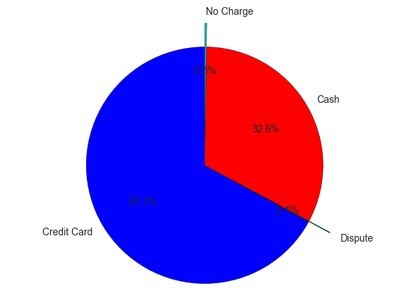


- It would appear that people pay with credit card primarily, lets look that this further

## Payment Type and Tip Amount

The following visualiations are relationships between tip and payment type.


```
#plot payment type with payment total

tip_count = pd.crosstab([Time_Index7.index, Time_Index7['tip_amount'].astype(bool)],Time_Index7['payment_type'] )
tip_count.plot(kind='bar', stacked=True)


```


    <matplotlib.axes._subplots.AxesSubplot at 0x16bab24a8>


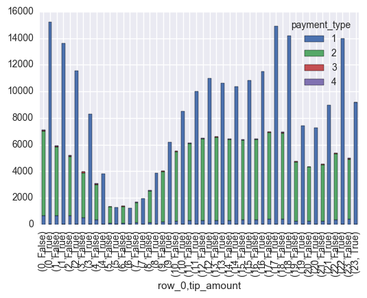


- Above is plot of payment type by hour of the day for Feb 7th, for this figure tip was converted to a Boolean in order to express whether or the traveler left a tip. Below is the same figure done for Sunday the 21st


```
tip_count = pd.crosstab([Time_Index21.index, Time_Index21['tip_amount'].astype(bool)],Time_Index21['payment_type'] )
tip_count.plot(kind='bar', stacked=True)
```


    <matplotlib.axes._subplots.AxesSubplot at 0x1c439d2b0>


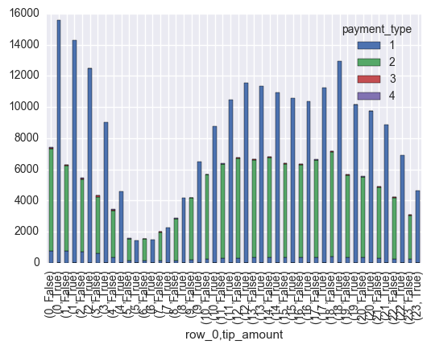


- Below is the same output except for Sunday the 28th, ultimately all of these figures look similar, for each of the majority of the time somebody tips, it is with a credit card.


```
tip_count = pd.crosstab([Time_Index28.index, Time_Index28['tip_amount'].astype(bool)],Time_Index28['payment_type'] )
tip_count.plot(kind='bar', stacked=True)
```


    <matplotlib.axes._subplots.AxesSubplot at 0x2518ae22588>


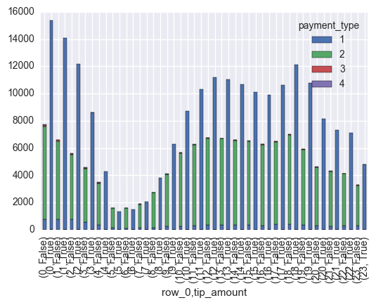


```
Pay_with_CC = Time_Index28.loc[(Time_Index28['tip_amount'] > 0) & (Time_Index28['payment_type'] == 1)].count() / Time_Index28.loc[(Time_Index28['tip_amount'] > 0)]['tip_amount'].count()
```

#### What percentage?

- Below we calculated what percentage of tips received are payed with a credit card.


```
Pay_with_CC['VendorID'] * 100 
```


    99.999012667476279


99% of the time people when people leave a tip they are paying with CC, Thats a LOT!


```
#makeing hour of pickup an callable index
Time_Index7.index = Time_Index7['tpep_pickup_datetime'].dt.hour#setting hour as index
Time_Index21.index = Time_Index21['tpep_pickup_datetime'].dt.hour
Time_Index28.index = Time_Index28['tpep_pickup_datetime'].dt.hour
```

# Fare Amount

- The following are visualizations of the fare amount for each all three Sundays. In regards to the total amount charges by the Yellow Cab drivers in NYC on Super Bowl Sunday. It seems that the Superbowl Sunday total per hour fare amount is very much the inline with the other two Sundays' data.


```
Time_Index7['fare_amount'].groupby(Time_Index7.index).mean().plot.area(stacked=False, color='r')
Time_Index21['fare_amount'].groupby(Time_Index21.index).mean().plot.area(stacked=False, color='g')
Time_Index28['fare_amount'].groupby(Time_Index28.index).mean().plot.area(stacked=False, color='b')

```


    <matplotlib.axes._subplots.AxesSubplot at 0x2b6f4155470>


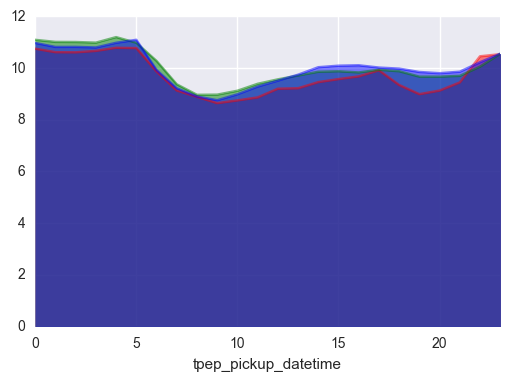


- Looking at the distribution of Tip and Fare amount, 600 tip! WOW!


```
Time_Index7['Tip_percentage'].describe()
```


    count    333485.000000
    mean         14.005716
    std          12.343687
    min           0.000000
    25%           0.000000
    50%          18.181818
    75%          22.600000
    max         600.000000
    Name: Tip_percentage, dtype: float64


```
Time_Index7['fare_amount'].describe()
```


    count    333485.000000
    mean          9.743383
    std           4.921561
    min           2.500000
    25%           6.000000
    50%           8.500000
    75%          12.000000
    max          38.000000
    Name: fare_amount, dtype: float64


- Lets create some bins for fare amount and tip to visualize the relationship


```
bins = [ 2.4, 10, 15, 20, 38]
```


```
group_names = ['Low', 'Medium', 'High', 'Very High']
categories = pd.cut(Time_Index7['fare_amount'], bins, labels=group_names)
Time_Index7['Fare_Cata'] = pd.cut(Time_Index7['fare_amount'], bins, labels=group_names)

```


```
bins1 = [-1, 5, 10, 20, 100]
```


```
group_names = ['Less then 5%', 'Less than 10%', 'Less than 20%', 'Greater than 20%']
Time_Index7['Tip_percentage'] = (Time_Index7['tip_amount']/Time_Index7['fare_amount'])*100
categories = pd.cut(Time_Index7['fare_amount'], bins1, labels=group_names)
Time_Index7['Tip_Cata'] = pd.cut(Time_Index7['Tip_percentage'], bins1, labels=group_names)

```

- The plot below show the amount of trips taken separated by fair amount, Low mean the fare was less than 10 dollars, medium means the fair was less than 15 dollars, high means the fair was less than 20 dollars, and Very high means the fair was less than 38 dollars which is the max fair.


```
fare_count = pd.crosstab([Time_Index7.Fare_Cata ],Time_Index7['Tip_Cata'] )
fare_count.plot(kind='bar', stacked=True)

```


    <matplotlib.axes._subplots.AxesSubplot at 0x2b6fc8c7dd8>


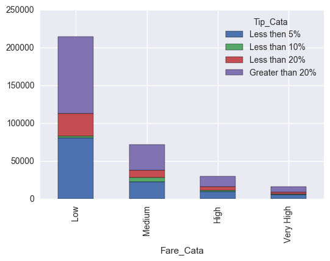


- If would appear that people tip pretty evenly for the most part. The most common tips for all four categories are either more than 20% or less than 5%(this includes no tip)

- The figure below shows the tips as broken down by rides per hour, it looks like tip frequencies significantly decrees between 5-6 am, this correlates with the number of trips during the time.


```
fare_count = pd.crosstab([Time_Index7.index ],Time_Index7['Tip_Cata'] )
fare_count.plot(kind='bar', stacked=True)

```


    <matplotlib.axes._subplots.AxesSubplot at 0x2b6ea85db70>


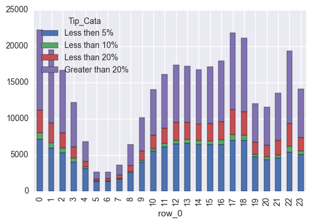


## Trips Taken

Features of interest are in regards to whether the taxi drive durations and the number of rides are impacted by the superbowl. Plot bellow shows a peak of the number of requested rides to occur at midnight, 5 and 6 pm. We aslo see another spike around 10 pm. For our analysis, early mornign taxi activtity can be ignored since it is most likely a result of usual Saturday nigth activity in the NYC. However, the afternoon activity is interesting since it shows as spike of activity a couple of hours before the kickoff of the Superbowl at 6:30pm.

The slowdown in requested rides between from 6pm till 10 pm is expected and observed on this chart. With many watching the game, it does not come as a surprise that this was the case. The plot also shows that requests for ride have increased it between 10 and 11 pm. This is not a surprise since it was expected to see an increase after the game as many are heading home or other post game events.

The bar charts below of number of requested rides for Sundays February 21st and February 28th, red and green respectively, have shown very similar patterns for the early morning, morning and afternoon hours as the Superbowl Sunday bar chart. However, a spike in requests is obvious for the pre and post game number of taxi ride requests. We also do not see a slow down between 6 and 10 pm while the game was played.
The area plot below also confirms this observation.


```
Time_Index7['fare_amount'].groupby(Time_Index7.index).count().plot(kind='bar')
Time_Index21['fare_amount'].groupby(Time_Index21.index).count().plot(kind='bar', color='red')
Time_Index28['fare_amount'].groupby(Time_Index28.index).count().plot(kind='bar', color='green')
```


    <matplotlib.axes._subplots.AxesSubplot at 0x2b69ecb74e0>


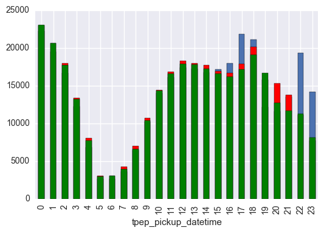


```
Time_Index7['passenger_count'].groupby(Time_Index7.index).count().plot.area(stacked=False, color='r')
Time_Index21['passenger_count'].groupby(Time_Index21.index).count().plot.area(stacked=False, color='g')
Time_Index28['passenger_count'].groupby(Time_Index28.index).count().plot.area(stacked=False, color='b')

```


    <matplotlib.axes._subplots.AxesSubplot at 0x2b6ee231668>


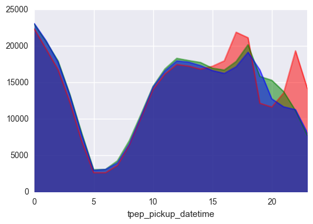


- So, the super bowl started at 6:30 EST, so let’s first look the traffic right before the super bowl 4-6. Keep in mind that the red line is still Super bowl Sunday and the other two lines are the control Sundays. Looking at the figure below it becomes clear that the is a slight difference when comparing each Sunday. 


```
Time_Index7['passenger_count'].groupby(Time_Index7.index).count()[16:18].plot.area(stacked=False, color='r')
Time_Index21['passenger_count'].groupby(Time_Index21.index).count()[16:18].plot.area(stacked=False, color='g')
Time_Index28['passenger_count'].groupby(Time_Index28.index).count()[16:18].plot.area(stacked=False, color='b')
```


    <matplotlib.axes._subplots.AxesSubplot at 0x2b6ef54dcf8>


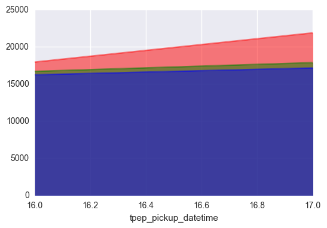


Let’s quantify it!


```
print('The number of trips during Superbowl Sunday:')
Time_Index7['passenger_count'].groupby(Time_Index7.index).count()[16:18].sum()
```

    The number of trips during Superbowl Sunday:
    


    39800


```
print('The number of trips during the 21st Sunday:')
Time_Index21['passenger_count'].groupby(Time_Index21.index).count()[16:18].sum()
```

    The number of trips during the 21st Sunday:
    


    34586


```
print('The number of trips during the 28st Sunday:')
Time_Index28['passenger_count'].groupby(Time_Index28.index).count()[16:18].sum()
```

    The number of trips during the 28st Sunday:
    


    33350


- Conclusion: We observed an increased about of taxi rides during the hours prior to the superbowl. Let’s see how it looks during the game.

#### During the game

- The Super bowl started at 6:30 and lasted roughly 3.5 hours so we looked at the trips from 6 to 9. The red line is still Super bowl Sunday and the other two lines are the control Sundays. Looking at the figure below it becomes clear that the is a slight difference when comparing each Sunday. 


```
Time_Index7['passenger_count'].groupby(Time_Index7.index).count()[18:21].plot.area(stacked=False, color='r')
Time_Index21['passenger_count'].groupby(Time_Index21.index).count()[18:21].plot.area(stacked=False, color='g')
Time_Index28['passenger_count'].groupby(Time_Index28.index).count()[18:21].plot.area(stacked=False, color='b')

```


    <matplotlib.axes._subplots.AxesSubplot at 0x2b6f08fd128>


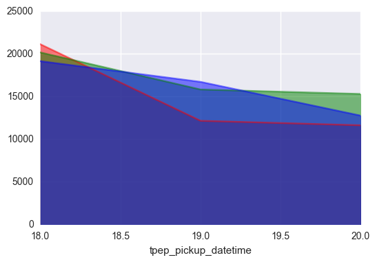


```
print('The number of trips during Superbowl:')

Time_Index7['passenger_count'].groupby(Time_Index7.index).count()[18:21].sum()
```

    The number of trips during Superbowl:
    


    44826


```
print('The number of trips during the 21st Sunday:')
Time_Index21['passenger_count'].groupby(Time_Index21.index).count()[18:21].sum()
```

    The number of trips during the 21st Sunday:
    


    51297


```
print('The number of trips during the 28st Sunday:')
Time_Index28['passenger_count'].groupby(Time_Index28.index).count()[18:21].sum()
```

    The number of trips during the 28st Sunday:
    


    48547


- Very cool results, there is a noticeable difference in Taxi trips both before the Super Bowl and during the actual game. 

## Trip Distance

- The next variable we are going to look at is the trip distance in miles, below we have a figure representing all three of the Sundays. Interesting that there is a strange spike in trip distance right before the Super bowl started.


```
Time_Index7['trip_distance'].groupby(Time_Index7.index).mean().plot.area(stacked=False, color='r')
Time_Index21['trip_distance'].groupby(Time_Index21.index).mean().plot.area(stacked=False, color='g')
Time_Index28['trip_distance'].groupby(Time_Index28.index).mean().plot.area(stacked=False, color='b')
plt.legend(loc='best')
```


    <matplotlib.legend.Legend at 0x2b6ef54d438>


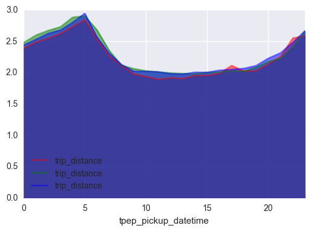


#### Right before the game
- Let’s take closer look at the trip distances before the game


```
Time_Index7['trip_distance'].groupby(Time_Index7.index).mean()[16:19].plot.area(stacked=False, color='r')
Time_Index21['trip_distance'].groupby(Time_Index21.index).mean()[16:19].plot.area(stacked=False, color='g')
Time_Index28['trip_distance'].groupby(Time_Index28.index).mean()[16:19].plot.area(stacked=False, color='b')
plt.legend(loc='best')
```


    <matplotlib.legend.Legend at 0x2b6fc8c1ef0>


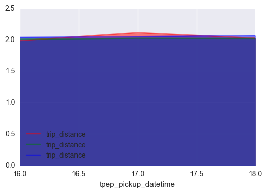


#### Is the increase in distance significant?  

We can test this by doing a quick ANOVA


```
Sunday1 =  Time_Index7.loc[(Time_Index7.index > 16) &(Time_Index7.index < 19)]['trip_distance']
Sunday2 =  Time_Index21.loc[(Time_Index21.index > 16) &(Time_Index21.index < 19)]['trip_distance']
Sunday3 =  Time_Index28.loc[(Time_Index28.index > 16) &(Time_Index28.index < 19)]['trip_distance']
```


```
f_val, p_val = stats.f_oneway(Sunday1, Sunday2, Sunday3)  
```

#### YES!

- By looking at the p value we can say there is significant difference between the trip distances expressed in the three groups.(alpha = .05)


```
p_val
```


    1.6357960869995579e-05


# Variable Engineering

## Trip Duration

- Created a variable for trip duration by subtracting the start time from the finish time for each trip


```
Time_Index7['Trip_duration'] = Time_Index7['tpep_dropoff_datetime'] - Time_Index7['tpep_pickup_datetime']
Time_Index7['Trip_duration'] = pd.to_timedelta(Time_Index7['Trip_duration'])
Time_Index7['Trip_duration'] = Time_Index7['Trip_duration'].dt.total_seconds()
Time_Index7 =Time_Index7.loc[Time_Index7['Trip_duration'] > 0]
Time_Index7 = Time_Index7.loc[Time_Index7['Trip_duration'] < 5400] 

```


```
Time_Index21['Trip_duration'] = Time_Index21['tpep_dropoff_datetime'] - Time_Index21['tpep_pickup_datetime']
Time_Index21['Trip_duration'] = pd.to_timedelta(Time_Index21['Trip_duration'])
Time_Index21['Trip_duration'] = Time_Index21['Trip_duration'].dt.total_seconds()
Time_Index21 =Time_Index21.loc[Time_Index21['Trip_duration'] > 0]
Time_Index21 = Time_Index21.loc[Time_Index21['Trip_duration'] < 5400]
 

```


```
Time_Index28['Trip_duration'] = Time_Index28['tpep_dropoff_datetime'] - Time_Index28['tpep_pickup_datetime']
Time_Index28['Trip_duration'] = pd.to_timedelta(Time_Index28['Trip_duration'])
Time_Index28['Trip_duration'] = Time_Index28['Trip_duration'].dt.total_seconds()
Time_Index28 =Time_Index28.loc[Time_Index28['Trip_duration'] > 0]
Time_Index28 = Time_Index28.loc[Time_Index28['Trip_duration'] < 5400]

```

- Plotted each three days by time of day. There doesn’t seem to be much difference between the control groups and Super bowl Sunday.


```
Time_Index7['Trip_duration'].groupby(Time_Index7.index).mean().plot.area(stacked=False, color='r')
Time_Index21['Trip_duration'].groupby(Time_Index21.index).mean().plot.area(stacked=False, color='g')
Time_Index28['Trip_duration'].groupby(Time_Index28.index).mean().plot.area(stacked=False, color='b')
plt.legend(loc='best')
```


    <matplotlib.legend.Legend at 0x2b6ac743cf8>


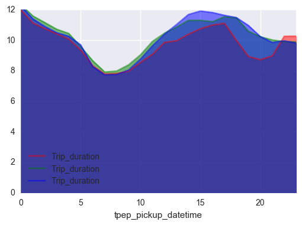


- Looking at summary statistics 


```
Time_Index7['Trip_duration'].describe()
```


    count    333485.000000
    mean         10.073725
    std           6.153925
    min           0.016667
    25%           5.516667
    50%           8.783333
    75%          13.283333
    max          87.550000
    Name: Trip_duration, dtype: float64


```
bins2 = [0, 3, 5, 10, 20, 90]
group_names = ['< 3', '< 5', '< 10', '< 20 ', '> 20']
categories = pd.cut(Time_Index7['Trip_duration'], bins2, labels=group_names)
Time_Index7['Trip_Cata'] = pd.cut(Time_Index7['Trip_duration'], bins2, labels=group_names)
```

- Put trip duration in bins and plotted it against tip amount(also in bins), interesting things to not, it looks like people are much more likely to tip between 5-10 percent when there rides are between 10-20 minutes long, whereas when the ride is less than 10 minutes people either tip more than 10% or less than 5%


```
fare_count = pd.crosstab([Time_Index7.Trip_Cata],Time_Index7['Tip_Cata'] )
fare_count.plot(kind='bar', stacked=True)
```


    <matplotlib.axes._subplots.AxesSubplot at 0x2b6e5b0cf60>


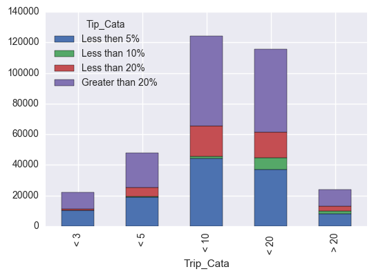


## Average Speed

- Created another variable called average speed. This was created by dividing trip distance by trip duration.


```
Time_Index7['Average_Speed'] = Time_Index7['trip_distance']/(Time_Index7['Trip_duration']/60)
Time_Index7['Average_Speed'] = Time_Index7['Average_Speed']*60
Time_Index7['Trip_duration'] = Time_Index7['Trip_duration']/60
```


```
Time_Index21['Average_Speed'] = Time_Index21['trip_distance']/(Time_Index21['Trip_duration']/60)
Time_Index21['Average_Speed'] = Time_Index21['Average_Speed']*60
Time_Index21['Trip_duration'] = Time_Index21['Trip_duration']/60
```


```
Time_Index28['Average_Speed'] = Time_Index28['trip_distance']/(Time_Index28['Trip_duration']/60)
Time_Index28['Average_Speed'] = Time_Index28['Average_Speed']*60
Time_Index28['Trip_duration'] = Time_Index28['Trip_duration']/60
```

- Plotted each three days by time of day. There doesn’t seem to be much difference between the control groups and Super bowl Sunday. What is interesting is there is a spike in Average speed around 5am, initially I thought it was because people we taking taxis into NY on highways, I tested this below using the coordinates but the data did not reflect this. Ultimately, I think it just because there are less people on the road at 5 am


```
Time_Index7['Average_Speed'].groupby(Time_Index7.index).mean().plot.area(stacked=False)
Time_Index21['Average_Speed'].groupby(Time_Index21.index).mean().plot.area(stacked=False)
Time_Index28['Average_Speed'].groupby(Time_Index28.index).mean().plot.area(stacked=False)
plt.legend(loc='best')
```


    <matplotlib.legend.Legend at 0x2b682aab6d8>


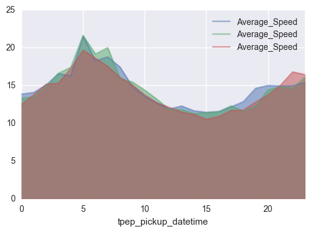


```
Counts = Time_Index7.index.value_counts()
```


```
Super_Sunday7 =  Time_Index7[(Time_Index7.index > 3) & (Time_Index7.index <= 5)]
```

- Pickup locations plotted below


```
map = Basemap(projection='merc', lat_0 = 40, lon_0 = -73,
    resolution = 'h', area_thresh = 0.1,
    llcrnrlon=-74.5, llcrnrlat=40.5,
    urcrnrlon=-73.5, urcrnrlat=41)
 
map.drawcoastlines()
map.drawcountries()
map.fillcontinents(color = 'white')
map.drawmapboundary()
 
lons = Super_Sunday7['pickup_longitude'].tolist()
lats = Super_Sunday7['pickup_latitude'].tolist()
x,y = map(lons, lats)
map.plot(x, y, 'bo', markersize=2 )
map.plot(x, y, 'bo', markersize=2 )

plt.show()
```


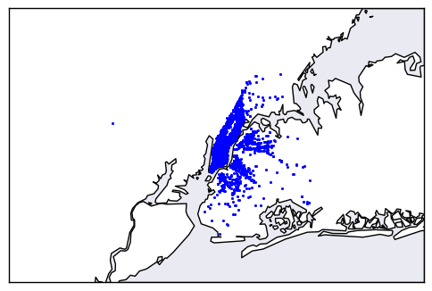


- Drop-off locations plotted below


```
map = Basemap(projection='merc', lat_0 = 40, lon_0 = -73,
    resolution = 'h', area_thresh = 0.1,
    llcrnrlon=-74.5, llcrnrlat=40.5,
    urcrnrlon=-73.5, urcrnrlat=41)
 
map.drawcoastlines()
map.drawcountries()
map.fillcontinents(color = 'white')
map.drawmapboundary()
 
lons = Super_Sunday7['dropoff_longitude'].tolist()
lats = Super_Sunday7['dropoff_latitude'].tolist()
x,y = map(lons, lats)
map.plot(x, y, 'bo', markersize=2)
plt.show()
```


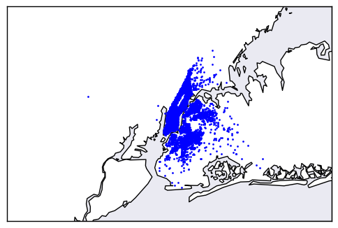


## Other Figures

Below is a correlation plot of Trip distance, Trip duration, average speed, and passenger count.


```
Sunday7_sub = Sunday7[['trip_distance', 'Trip_duration', 'Average_Speed','passenger_count' ]]
```


```
#from the couse page
sns.set(style="darkgrid") 

f, ax = plt.subplots(figsize=(9, 9))

sns.heatmap(Sunday7_sub.corr(), cmap=None, annot=True)

f.tight_layout()
```


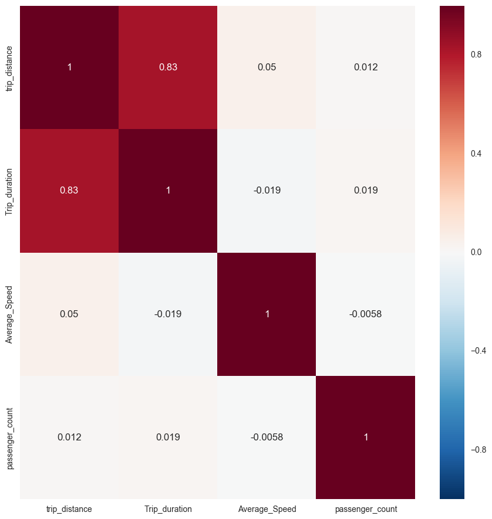


- Here is a boxplot of fare divided by number of passengers, I thought maybe fares would be great depending on passengers but the data doesn’t really show that.


```

Sunday7.boxplot(column='total_amount', by = 'passenger_count' )

```


    <matplotlib.axes._subplots.AxesSubplot at 0x251f35debe0>


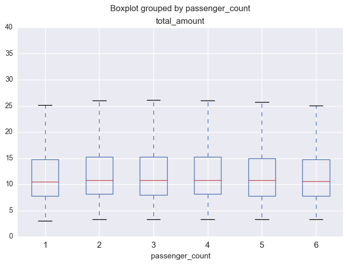


# FINISHED


```

```
